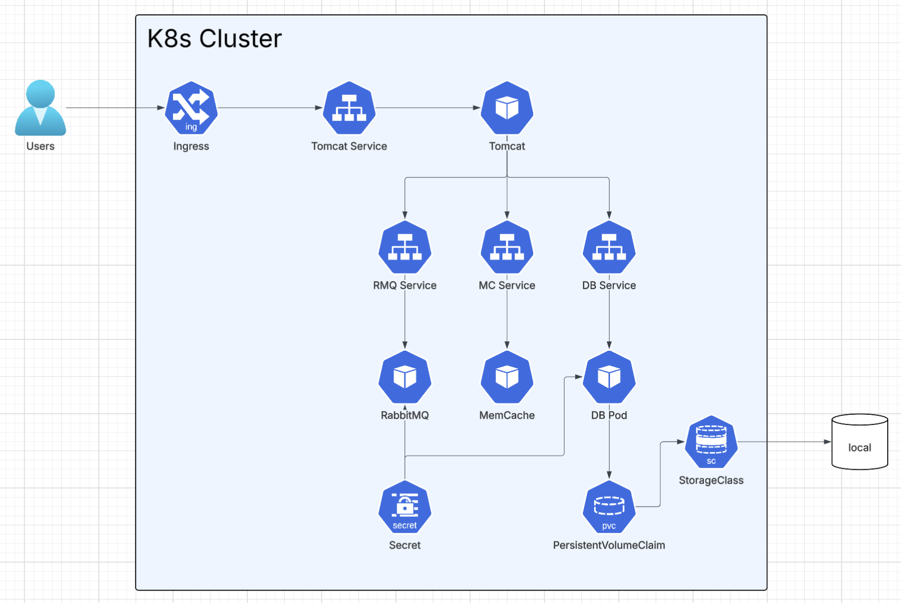

sql dump file:

# Kubernetes Cloud-Native Re-Architecture - DevOps Portfolio Project

[](https://kubernetes.io/)
[](https://minikube.sigs.k8s.io/)
[](https://www.docker.com/)
[](https://www.ansible.com/)
[](https://www.jenkins.io/)

## 🎯 Project Overview

This project demonstrates the **cloud-native re-architecture of the VProfile application** on a **local Kubernetes cluster with Minikube**. The goal is to simulate a cloud-native production environment using open-source tools and modern DevOps practices.

### 🎓 Learning Context
*Project completed as part of a DevOps training, focused on modernizing applications using Kubernetes, Docker, CI/CD, and Infrastructure as Code (IaC).* 

## 🚀 Key Achievements

- ✅ **Multi-tier deployment on Kubernetes (Minikube)**
- ✅ **Full containerization with Docker**
- ✅ **Infrastructure provisioning automated with Ansible**
- ✅ **CI/CD with Jenkins**
- ✅ **Configuration and secrets management with Kubernetes**
- ✅ **Scalability and fault tolerance via K8s**

## 🛠️ Technology Stack

| Category              | Tool / Service         | Role                                 |
|-----------------------|-----------------------|--------------------------------------|
| **Orchestration**     | Kubernetes, Minikube  | Local cluster, orchestration         |
| **Containerization**  | Docker                | Image build & packaging              |
| **CI/CD**             | Jenkins               | Integration/deployment pipeline      |
| **Provisioning**      | Ansible               | Infrastructure automation            |
| **Database**          | MySQL (container)     | Relational storage                   |
| **Messaging**         | RabbitMQ (container)  | Message broker                       |
| **App**               | Java/Spring           | VProfile application                 |
| **Reverse Proxy**     | Nginx (container)     | Proxy and static content             |
| **Secrets**           | K8s Secrets           | Credentials management               |

## 🎯 Project Objectives

Simulate a **cloud-native production environment** for the VProfile stack, locally, with:
- ☁ **Flexible and modular infrastructure**
- 🔐 **Scalable, secure, and fault-tolerant architecture**
- 🔧 **Infrastructure as Code (IaC) principles**
- 🚀 **Automated build, deployment, and configuration**

## 🏗️ Architecture Overview



## 📁 Project Structure

```
.
├── ansible/                  # Ansible playbooks and templates
├── assets/                   # Architecture diagrams
│   └── archi.png
├── Docker-files/             # Dockerfiles for each component
│   ├── app/
│   ├── db/
│   └── web/
├── kubedefs/                 # Kubernetes manifests (YAML)
│   ├── appdeploy.yaml
│   ├── appservice.yaml
│   ├── appingress.yaml
│   ├── dbdeploy.yaml
│   ├── dbservice.yaml
│   ├── dbpvc.yaml
│   ├── mcdep.yaml
│   ├── mcservice.yaml
│   ├── rmqdeploy.yaml
│   ├── rmqservice.yaml
│   └── secret.yaml
├── Jenkinsfile               # CI/CD pipeline
├── pom.xml                   # Maven build
├── README.md                 # Documentation
├── src/                      # Java/Spring source code
└── ...
```

## 🧠 Why This Project?

This project highlights my skills in:
- **Cloud-native architecture with Kubernetes**
- **Containerization and orchestration**
- **DevOps automation (CI/CD, IaC)**
- **Security, secrets, and configuration management**
- **Modernizing multi-tier applications**

It demonstrates the transformation of a **traditional application** into a **resilient, modular, and automated architecture**.

## 🏁 Next Steps & Improvements

**Technical enhancements:**
- Multi-cluster deployment (cloud K8s)
- Monitoring & observability (Prometheus, Grafana)
- Advanced security (NetworkPolicy, RBAC, OPA)
- Helm charts for packaging
- Automated tests (SonarQube, JUnit)

**Architecture improvements:**
- Blue/Green & Canary deployments
- Automated Backup & Disaster Recovery
- Zero-downtime migration

## 📝 Portfolio Note

This project is a **cloud-native re-architecture exercise** demonstrating proficiency in **Kubernetes, Docker, CI/CD, and IaC** in a DevOps context. It illustrates the transition from a traditional model to a modern, automated, and scalable approach.

**Skills demonstrated:**
- Kubernetes & Cloud-Native Architecture
- CI/CD & IaC integration
- Security & secrets management
- Application modernization


